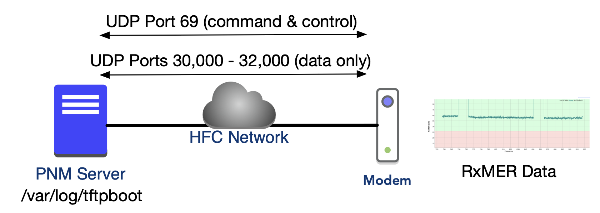

# RxMER Per Subcarrier — DOCSIS 3.1 PNM Tool

A set of scripts for triggering and collecting **RxMER (Receive Modulation Error Ratio) per subcarrier** measurements from DOCSIS 3.1 cable modems via SNMP and TFTP. Implementations are provided in **Perl**, **Bash**, and **Python 3**.

---

## What Is RxMER?

RxMER is a per-subcarrier signal quality metric specific to DOCSIS 3.1 OFDM downstream channels. It quantifies, in dB, how cleanly each individual subcarrier is being received by the cable modem relative to the ideal constellation point.

A DOCSIS 3.1 OFDM downstream channel can span up to 192 MHz and contain up to 7,680 active subcarriers at 25 kHz spacing (or up to 3,840 at 50 kHz spacing). Measuring RxMER across all of them simultaneously gives operators a high-resolution spectral view of plant impairments — something not possible with the single aggregate MER metric from legacy SC-QAM channels.

**Why it matters for plant health:**

- **Ingress identification** — Narrowband ingress shows up as localized dips in the RxMER profile across a small range of subcarriers.
- **Microreflections and group delay** — Periodic ripple in the RxMER profile indicates multipath/echo, with the ripple period inversely related to the reflection delay.
- **Laser clipping / nonlinearity** — Broadband depression across the entire OFDM channel.
- **Equalizer diagnostics** — When compared to the modulation profile, subcarriers with RxMER below the threshold indicate capacity limitation or impending uncorrectable errors.
- **Capacity planning** — Operators can identify the maximum modulation order sustainable on each subcarrier, enabling intelligent profile-based modulation.

This tool is used by cable operators, network engineers, and PNM (Proactive Network Management) systems as described in SCTE 285 and CableLabs CM-SP-CM-OSSIv3.1.

---

## Architecture

The workflow involves three components: the operator workstation running these scripts, the cable modem under test, and a TFTP server that receives the binary data file.



1. The script sends SNMP SET commands to the modem configuring the TFTP destination (server IP, path, upload mode).
2. The script sets the RxMER measurement trigger on the modem's OFDM downstream interface.
3. The modem performs the measurement and uploads a binary file to the TFTP server.
4. The operator retrieves the file from the TFTP server and analyzes it (optionally using `visualize_rxmer.py`).

---

## Prerequisites

### All Scripts
- A cable modem locked to a **DOCSIS 3.1 OFDM downstream channel** (the modem must present an interface with `IF-MIB::ifType = 277` / `docsOfdmDownstream`).
- An **SNMP v2c read-write community string** configured on the modem.
- A **TFTP server** running and reachable by the modem. The TFTP server needs write access enabled (modems perform a TFTP Write, not Read).
- Network access from the operator workstation to the modem on UDP/161 (SNMP).

### Perl Script (`getRxMER.pl`)
- Perl 5.10+
- `net-snmp` package (provides `snmpget`, `snmpset`, `snmpbulkwalk` command-line tools)
- CPAN modules: `Net::SNMP`, `Net::Ping`, `Data::Dumper`, `Getopt::Long`

### Bash Script (`getRxMER.sh`)
- Bash 4.0+
- `net-snmp` package (provides `snmpget`, `snmpset`, `snmpbulkwalk`)

### Python Script (`getRxMER.py`)
- Python 3.9+
- `pysnmp` (pure-Python SNMP library — no system `snmpd` required)
- For visualization: `matplotlib` (optional; required only for `visualize_rxmer.py`)

---

## Installation

### Ubuntu / Debian

```bash
# net-snmp tools (required for Perl and Bash scripts)
sudo apt-get update
sudo apt-get install -y snmp snmp-mibs-downloader

# Perl modules
sudo apt-get install -y perl libnet-snmp-perl

# Python 3 dependencies
sudo apt-get install -y python3 python3-pip
pip3 install -r requirements.txt
```

### CentOS / RHEL / Fedora

```bash
# net-snmp tools
sudo yum install -y net-snmp-utils

# Perl modules
sudo yum install -y perl perl-Net-SNMP
# Or via CPAN:
sudo cpan Net::SNMP Net::Ping

# Python 3 dependencies
sudo yum install -y python3 python3-pip
pip3 install -r requirements.txt
```

### macOS (Homebrew)

```bash
brew install net-snmp python3
pip3 install -r requirements.txt
```

---

## TFTP Server Setup

The modem performs a TFTP **Write** (WRQ) to deposit the RxMER data file. The TFTP server must allow incoming write requests.

### Ubuntu / Debian

```bash
sudo apt-get install -y tftpd-hpa
sudo nano /etc/default/tftpd-hpa
```

Set `TFTP_OPTIONS` to include `--create` to allow uploads:

```
TFTP_OPTIONS="--secure --create"
TFTP_DIRECTORY="/var/lib/tftpboot"
TFTP_ADDRESS="0.0.0.0:69"
```

```bash
sudo systemctl restart tftpd-hpa
sudo chmod 777 /var/lib/tftpboot      # or set appropriate ownership
```

### CentOS / RHEL

```bash
sudo yum install -y tftp-server
sudo nano /etc/xinetd.d/tftp
# Set: disable = no
# Set: server_args = -c -s /var/lib/tftpboot
sudo systemctl start xinetd
sudo chmod 777 /var/lib/tftpboot
```

**Firewall:** Allow UDP port 69 inbound on the TFTP server:

```bash
# iptables
sudo iptables -I INPUT -p udp --dport 69 -j ACCEPT

# firewalld
sudo firewall-cmd --add-service=tftp --permanent
sudo firewall-cmd --reload
```

---

## Usage

### Perl Script

```bash
perl getRxMER.pl [OPTIONS] <ipmode> <cm_ip> <community_rw> <pnm_server_ip>
```

**Arguments:**

| Argument         | Description                                              |
|------------------|----------------------------------------------------------|
| `ipmode`         | IP address family: `1` = IPv4, `2` = IPv6               |
| `cm_ip`          | Cable modem management IP address                        |
| `community_rw`   | SNMP v2c read-write community string                     |
| `pnm_server_ip`  | IP address of the TFTP / PNM collection server           |

**Options:**

| Flag             | Description                                              |
|------------------|----------------------------------------------------------|
| `-v`, `--verbose`| Print SNMP commands and detailed output                  |
| `-h`, `--help`   | Show help and exit                                       |

**Examples:**

```bash
# IPv4 modem, private community, local TFTP server
perl getRxMER.pl 1 192.168.100.1 private <tftp_server_ip>

# IPv6 modem with verbose output
perl getRxMER.pl -v 2 <ipv6_address> <community_string> <tftp_server_ip>
```

---

### Bash Script

```bash
bash getRxMER.sh [OPTIONS] <ipmode> <cm_ip> <community_rw> <pnm_server_ip>
```

Same arguments and options as the Perl script.

```bash
# IPv4
bash getRxMER.sh 1 10.2.4.100 private <tftp_server_ip>

# Verbose mode
bash getRxMER.sh -v 1 192.168.100.1 <community_string> <tftp_server_ip>
```

---

### Python Script

```bash
python3 getRxMER.py [OPTIONS] <ipmode> <cm_ip> <community_rw> <pnm_server_ip>
```

Additional Python-specific options:

| Flag              | Description                                             |
|-------------------|---------------------------------------------------------|
| `-f FILENAME`     | Override output filename (default: `RxMerData`)         |
| `-t SECONDS`      | SNMP timeout in seconds (default: 5)                    |
| `-r COUNT`        | SNMP retry count (default: 2)                           |
| `-v`, `--verbose` | Debug-level logging                                     |
| `-h`, `--help`    | Show help and exit                                      |

```bash
# Basic usage
python3 getRxMER.py 1 192.168.100.1 private <tftp_server_ip>

# Custom filename, verbose
python3 getRxMER.py -v -f ModemA_RxMER 1 10.2.4.100 <community_string> <tftp_server_ip>
```

---

### Visualizer

After collecting the RxMER binary file from the TFTP server:

```bash
python3 visualize_rxmer.py [OPTIONS] <rxmer_file>
```

| Flag              | Description                                               |
|-------------------|-----------------------------------------------------------|
| `-o FILE`         | Output plot filename (default: `rxmer_plot.png`)          |
| `--threshold DB`  | Overlay a minimum RxMER threshold line at this dB value   |
| `--spacing KHZ`   | Subcarrier spacing: `25` or `50` kHz (default: `25`)      |
| `--raw`           | Skip header parsing; treat file as raw uint16 values      |
| `--no-plot`       | Print statistics only; skip plot generation               |
| `-v`, `--verbose` | Debug-level logging                                       |

```bash
# Basic plot
python3 visualize_rxmer.py RxMerData

# With threshold line and custom output
python3 visualize_rxmer.py --threshold 30 --output rxmer_modemA.png RxMerData

# Statistics only (no matplotlib required)
python3 visualize_rxmer.py --no-plot RxMerData
```

---

## SNMP / TFTP Workflow

The following DOCS-PNM-MIB objects are used (all under `1.3.6.1.4.1.4491.2.1.27`):

| MIB Object                       | OID                                | Description |
|----------------------------------|------------------------------------|-------------|
| `docsPnmBulkDestIpAddrType`      | `.27.1.1.1.1.0`                    | IP address type of TFTP server (1=IPv4, 2=IPv6) |
| `docsPnmBulkDestIpAddr`          | `.27.1.1.1.2.0`                    | TFTP server IP address (raw bytes) |
| `docsPnmBulkDestPath`            | `.27.1.1.1.3.0`                    | TFTP path on server (empty = root) |
| `docsPnmBulkUploadControl`       | `.27.1.1.1.4.0`                    | 3=autoUpload triggers upload on data ready |
| `docsPnmCmDsOfdmRxMerEnable`     | `.27.1.2.5.1.1.<ifIndex>`          | Set to 1 to trigger RxMER measurement |
| `docsPnmCmDsOfdmRxMerFileName`   | `.27.1.2.5.1.8.<ifIndex>`          | Override filename for the TFTP file |
| `docsPnmCmCtlTest`               | `.27.1.2.1.1`                      | Confirms active test (6 = dsOfdmRxMERPerSubCar) |
| `docsPnmBulkFileUploadStatus`    | `.27.1.1.2.1.3.<fileIndex>`        | Upload completion status |

The `<ifIndex>` is dynamically discovered by walking `IF-MIB::ifType` and finding the interface with `ifType = 277` (`docsOfdmDownstream`).

---

## Output File Format

The modem deposits a binary file to the TFTP server. The format follows **CM-SP-CM-OSSIv3.1 §PNM**:

```
Offset  Length  Field
------  ------  -----
0       4       File type ID: 0x504E4D05 (PNM + 0x05 = RxMER per subcarrier)
4       4       Capture time (Unix epoch, uint32 big-endian)
8       1       Channel ID (uint8)
9       6       CM MAC address (6 bytes)
15      4       First active subcarrier index (uint32 big-endian)
19      4       Last active subcarrier index (uint32 big-endian)
23      4       Number of subcarrier values N (uint32 big-endian)
27      N×2     RxMER values: N × uint16 big-endian
                  Value = RxMER × 4  (quarter-dB resolution)
                  0xFFFF = pilot tone or excluded subcarrier
```

RxMER in dB = `raw_value / 4.0`

A 192 MHz channel at 25 kHz subcarrier spacing with no exclusion bands would produce up to 7,680 values, resulting in a data payload of ~15 KB.

---

## Troubleshooting

### SNMP timeout / no response
- Verify the modem's management IP is reachable: `ping <cm_ip>`
- Confirm the read-write community string is correct. Note: `public` is typically a read-only community; the RxMER trigger requires **read-write** access.
- Check that UDP/161 is not blocked by an ACL on the CMTS or an intermediate firewall.
- For IPv6 modems, ensure your workstation has an IPv6 route to the modem's management address.

### No OFDM interface found (ifType 277)
- The modem may not be locked to a DOCSIS 3.1 downstream OFDM channel. Confirm the modem registration mode with your CMTS — DOCSIS 3.0-only registration will not present an OFDM interface.
- The CMTS must have a DOCSIS 3.1 licensed downstream OFDM channel configured and the modem must have acquired it.

### TFTP upload fails / status remains `error` (7)
- Verify the TFTP server is running: `sudo systemctl status tftpd-hpa`
- Confirm the TFTP server allows incoming Write Requests (`--create` flag in tftpd-hpa, or `server_args = -c` in xinetd).
- Check that the TFTP root directory is writable by the TFTP daemon user.
- Confirm UDP/69 is open on the TFTP server host firewall.
- The modem initiates the TFTP connection *to* the PNM server — ensure no NAT or firewall blocks the modem's outbound UDP/69.

### Upload status stuck at `uploadInProgress` (3)
- A slow or high-latency TFTP path can cause long transfer times for large files. Wait and re-poll.
- Check for packet loss between the modem and the TFTP server.

### File present on TFTP server but data looks wrong
- Use `--raw` mode with `visualize_rxmer.py` to skip header validation and inspect the raw values.
- Some early CM firmware implementations use slightly different header layouts. The `--raw` flag interprets the entire file as packed uint16 big-endian values divided by 4.

### `prefixSnmpGetCmRW` vs `prefixSnmpGetCm` (historical note)
Previous versions of these scripts defined two identical SNMP prefix variables. The redundant `prefixSnmpGetCmRW` has been removed. Both GET and SET operations use the same community string and prefix.

---

## Author

**Brady Volpe, MSEE**  
Volpe Firm — [volpefirm.com](https://volpefirm.com)  
DOCSIS / RF Engineering / Proactive Network Management

---

## References

- CableLabs DOCS-PNM-MIB: https://mibs.cablelabs.com/MIBs/DOCSIS/DOCS-PNM-MIB.txt
- CM-SP-CM-OSSIv3.1 (CableLabs)
- CM-SP-PHYv3.1 (CableLabs)
- SCTE 285: DOCSIS 3.1 RxMER PNM Test Validation

---

## License

Apache License 2.0 — see [LICENSE](LICENSE) for full text.
